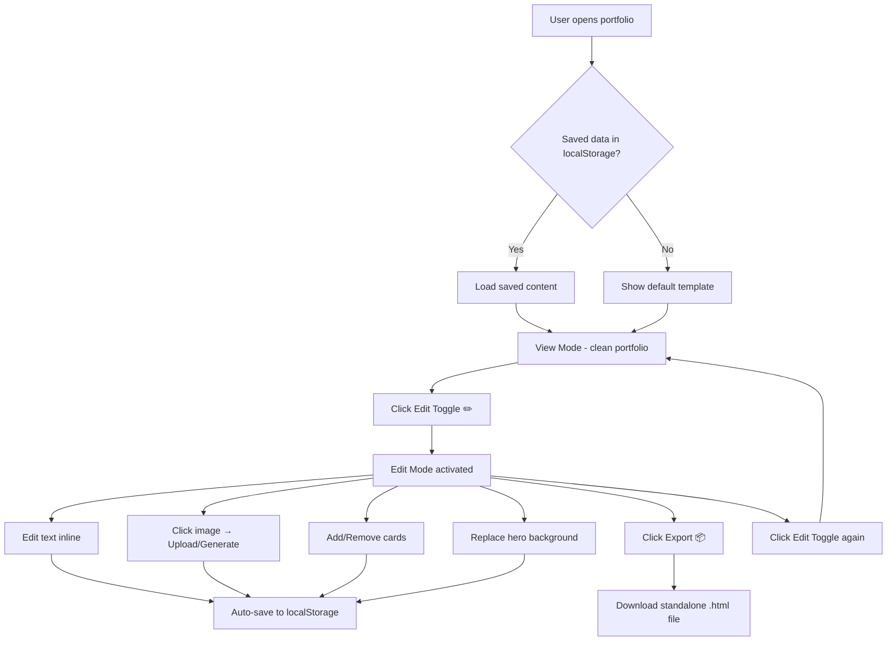

# Web-Editable Portfolio Template

Transform the existing single-page portfolio into a **non-developer-friendly, web-editable template** where users can customize all content directly in the browser.

## Core Features

| Feature | Description |
|---------|-------------|
| **Edit Mode Toggle** | Floating button to switch between clean view and edit mode |
| **Inline Text Editing** | All text content is editable (not fonts/sizes/formatting) |
| **Image Management** | Upload or Generate images for every image/icon slot |
| **Section Management** | Add/remove skill cards, project cards, and contact items |
| **Persistence** | Auto-save to localStorage + Export as standalone HTML |
| **Image Generation** | Canvas-based abstract image generator from text descriptions |

## Constraints

| Section | Min | Max | Special Rule |
|---------|-----|-----|-------------|
| Skills | 3 | ∞ | Cannot go below 3 |
| Projects | 0 | ∞ | If 0 projects → entire section is hidden |
| Contacts | 1 | ∞ | Cannot go below 1 |

## Proposed Changes

### Overview of New/Modified Files

| File | Action | Purpose |
|------|--------|---------|
| `index.html` | MODIFY | Add edit-mode UI, data attributes, modals |
| `style.css` | MODIFY | Add editor styles, overlays, modals, toggle |
| `app.js` | MODIFY | Keep existing nav logic, add editor initialization |
| `editor.js` | NEW | Core editor engine (text, images, sections) |
| `generator.js` | NEW | Canvas-based image/icon generator |

---

### [MODIFY] [index.html](file:///media/skmdraihan/A012A93812A91476/__GitHub__/Single-Page-Portfolio-Website/index.html)

- Add `data-editable="true"` attributes to all text elements (h1, h2, p, a text) — these become `contenteditable` when edit mode is on
- Add `data-editable-img` attribute to all `` elements — these show upload/generate overlay in edit mode
- Add `data-editable-bg` to hero section — enables background image replacement
- Add floating **Edit Mode toggle button** (pencil icon, fixed position bottom-right)
- Add **"+ Add Skill" / "+ Add Project" / "+ Add Contact"** buttons (visible only in edit mode)
- Add **delete (×) buttons** on each card (visible only in edit mode, respects min counts)
- Add a **modal dialog** for: image generation prompt, export confirmation
- Add an **Export button** (visible only in edit mode) in fixed toolbar
- Add an **editor toolbar** (fixed top bar in edit mode) with: Save, Export, and Reset buttons
- Load `editor.js` and `generator.js` scripts

### [MODIFY] [style.css](file:///media/skmdraihan/A012A93812A91476/__GitHub__/Single-Page-Portfolio-Website/style.css)

New CSS additions:
- **`.edit-mode` body class** — adds subtle dashed outlines on editable elements
- **`.editor-toolbar`** — fixed top bar with glassmorphism, shown in edit mode
- **`.edit-toggle-btn`** — floating circular button (bottom-right), always visible
- **`.img-overlay`** — overlay on images with Upload/Generate buttons
- **`.delete-btn`** — red × on removable cards
- **`.add-btn`** — "+ Add" buttons styled consistently
- **`.modal-overlay` / `.modal`** — prompt modal for image description
- **`.editable-highlight`** — subtle highlight on editable text on hover
- **Responsive adjustments** for all editor UI elements

### [NEW] [editor.js](file:///media/skmdraihan/A012A93812A91476/__GitHub__/Single-Page-Portfolio-Website/editor.js)

Core editor engine with these modules:

```
EditorManager
├── toggleEditMode()      — toggle body.edit-mode class, show/hide editor UI
├── initEditableText()    — make text elements contenteditable when in edit mode
├── initEditableImages()  — add upload/generate overlays to images
├── initHeroBackground()  — special handler for hero bg image replacement
│
├── SectionManager
│   ├── addSkill()        — clone template, add new skill card
│   ├── removeSkill()     — remove skill (blocked if ≤ 3)
│   ├── addProject()      — clone template, add new project card
│   ├── removeProject()   — remove project (show/hide section based on count)
│   ├── addContact()      — clone template, add new contact item
│   └── removeContact()   — remove contact (blocked if ≤ 1)
│
├── PersistenceManager
│   ├── saveToLocalStorage()  — serialize all content to JSON, store in localStorage
│   ├── loadFromLocalStorage() — restore saved content on page load
│   └── resetToDefault()      — clear localStorage, reload original template
│
└── ExportManager
    └── exportAsHTML()    — capture full DOM state, inline all styles/images as 
                           base64, generate downloadable .html file
```

**Key behaviors:**
- On page load: check localStorage for saved data, apply if found
- In edit mode: all `[data-editable]` elements get `contenteditable="true"`
- Image overlays: each `` gets a floating overlay with "📁 Upload" and "✨ Generate" buttons
- Upload: opens file picker, reads file as base64 data URL, replaces img src
- Generate: opens modal asking for description → calls `generator.js` → creates canvas image → replaces img src
- Auto-save: debounced save to localStorage on every content change
- Delete buttons respect minimums (disabled state + tooltip when at min)

### [NEW] [generator.js](file:///media/skmdraihan/A012A93812A91476/__GitHub__/Single-Page-Portfolio-Website/generator.js)

Canvas-based image/icon generator that creates unique abstract images from text descriptions. Method:

1. Hash the description text to get seed values
2. Generate a **gradient mesh background** using seeded colors derived from the text
3. Add **geometric shapes** (circles, triangles, lines) positioned by the hash
4. Overlay the **first letter or short text** of the description as a stylized watermark
5. Return as a base64 data URL

```
ImageGenerator
├── generateFromText(text, width, height) → dataURL
├── generateIcon(text, size) → dataURL  (simpler, icon-focused)
├── hashString(str) → number
└── seededRandom(seed) → pseudorandom float
```

This gives each description a **unique, deterministic, visually distinct** image — no external API needed, fully offline.

> [!IMPORTANT]
> The generated images are abstract/geometric art based on the text description. They serve as unique visual placeholders. If the user wants photographic images, they should use the Upload option instead.

---

## User Flow



## Open Questions

> [!IMPORTANT]
> **Export format**: The export will be a **single self-contained HTML file** with all CSS inlined and images as base64 data URLs. This means the file might be large if there are many high-res images. Should I add an image compression step (resize to max 1200px width) during export to keep file sizes reasonable?

> [!NOTE]
> **Social links in footer**: The WhatsApp, GitHub, Behance icons — should those link URLs also be editable? (Currently they're all `href="#"`)

## Verification Plan

### Automated Tests
- Open the site in browser, toggle edit mode, verify all text elements become editable
- Test image upload flow (select file, verify it replaces the image)
- Test image generation (enter description, verify unique image is created)
- Test add/remove skills (verify min 3 constraint)
- Test add/remove projects (verify section hides when empty)
- Test add/remove contacts (verify min 1 constraint)
- Test localStorage persistence (edit, reload, verify content persists)
- Test export (download file, open in new tab, verify it renders correctly)
- Test reset functionality (verify it restores default content)

### Manual Verification
- Visual inspection of edit mode UI (overlays, buttons, outlines)
- Responsive testing on different viewports
- Export file quality check
